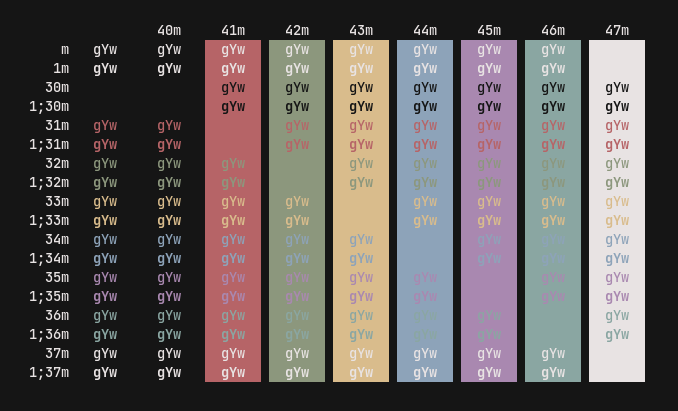
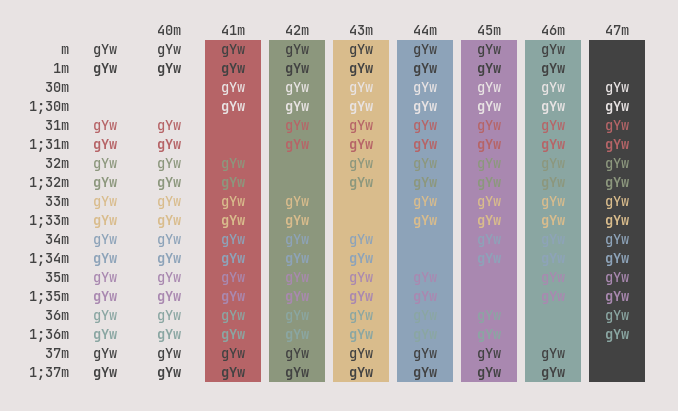

<h1 align="center">Paradise</h1>

<p align="center">
  <a href="https://github.com/paradise-theme/paradise/stargazers"></a>
  <a href="https://github.com/paradise-theme/paradise/issues"></a>
  <a href="https://github.com/paradise-theme/paradise/network/members"></a>
</p>

## Pallete

### Dark


### Light


## Ports 

### Terminal
  - Alacritty
  - Kitty

### Editor
  - Lite-xl
  - Nvim with [Conscious](https://github.com/Manas140/Conscious), [DayDream.nvim](https://github.com/Mayooonaiselol/Daydream.nvim)
  - Vscode with [Plugin](https://github.com/paradise-theme/vscode)
  
### Other
  - Dunst
  - [Gtk](https://github.com/paradise-theme/gtk)
  - PowerShell 
  - Zathura

## Installation
### Clone repo
```
git clone https://github.com/paradise-theme/paradise.git && cd paradise
```

#### On Linux 
```
./install.sh -[l|d][a]
```

#### On Windows
- Open the settings section by pressing `C+,`
- You will see a setting button on your bottom left corner and press it
- Your default editor will show up then scroll down to a part where it says "schemes"
- Copy the content from `[light|dark]/oth/powershell/powershell.json` and paste it in.
