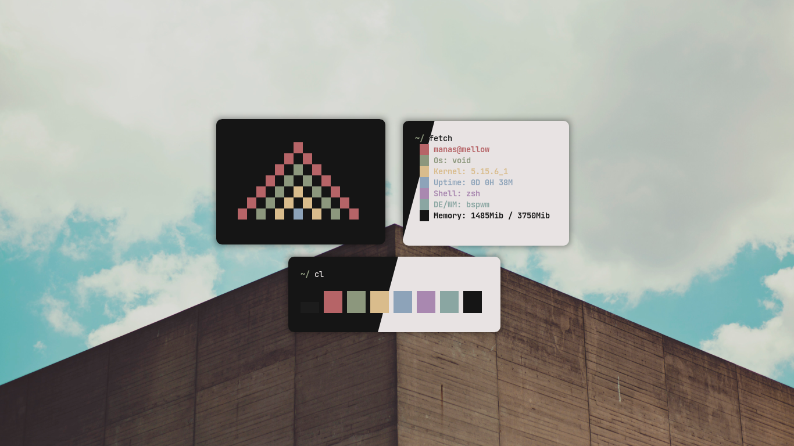

<h1 align="center">Paradise</h1>

<p align="center">
    <a href="https://github.com/Manas140/paradise/stargazers"></a>
    <a href="https://github.com/Manas140/paradise/issues"></a>
    <a href="https://github.com/Manas140/paradise/network/members"></a>
</p>

<p align="center">
  
</p>

# Installation
## Clone repo

```
  git clone https://github.com/Manas140/paradise.git && cd paradise
```
## Linux
### Install dark

```
  ./install.sh d
```
### Install light

```
  ./install.sh l
```

## Windows

```
  Open the settings section by pressing `C+,`
  You will see a setting button on your bottom left corner and press it
  Your default editor will show up then scroll down to a part where it says "schemes"
```
### Install Light

```
  Copy the content from 'light/powershell/powershell.json' and paste it in.
```

### Install Dark

```
  Copy the content from 'dark/powershell/powershell.json' and paste it in.
```
