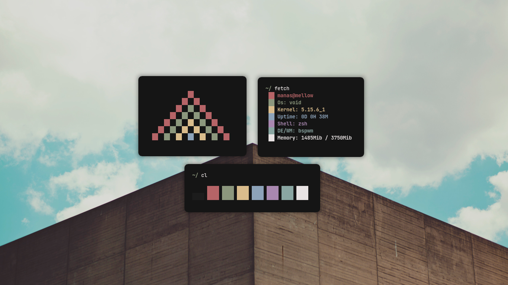
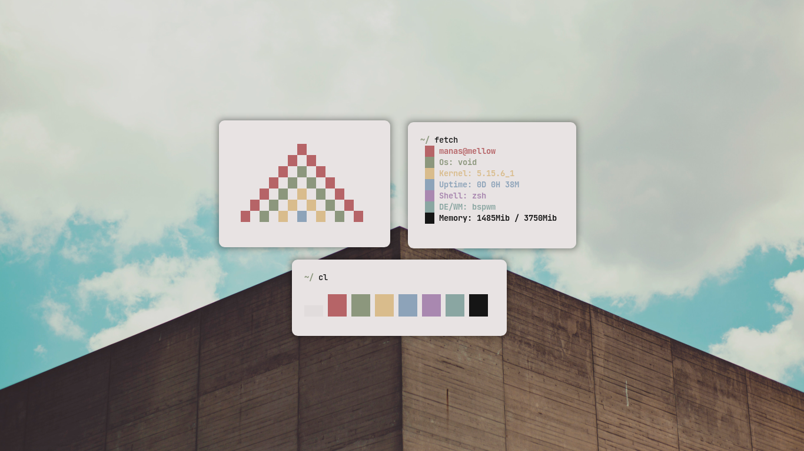
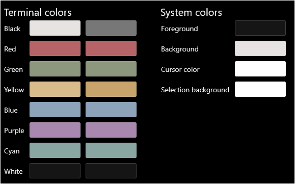

<h1 align="center">Paradise</h1>

<p align="center">
    <a href="https://github.com/Manas140/paradise/stargazers"></a>
    <a href="https://github.com/Manas140/paradise/issues"></a>
    <a href="https://github.com/Manas140/paradise/network/members"></a>
</p>

# Installation
## Clone repo

```
  git clone https://github.com/Manas140/paradise.git && cd paradise
```
## Install dark
<p align="center">
  
</p>

```
  ./install.sh d
```
## Install light
<p align="center">
  
</p>

```
  ./install.sh l
```

## Windows user
1. Open the settings section by pressing `C+,`
2. You will see a setting button on your bottom left corner and press it
3. Your default editor will show up then scroll down to a part where it says "schemes"
4. Copy the content from `dark/powershell/powershell.json` and paste it in. If you wanna use dark theme
  > Copy the content from `light/powershell/powershell.json` and paste it in. **WARNING: YOUR EYE MAY SPOIL AS POWERSHELL RENDER DIFFERENTLY**
5. Tada! Your done :D

<p align="center">
  
</p>

<p align="center">
  
</p>
